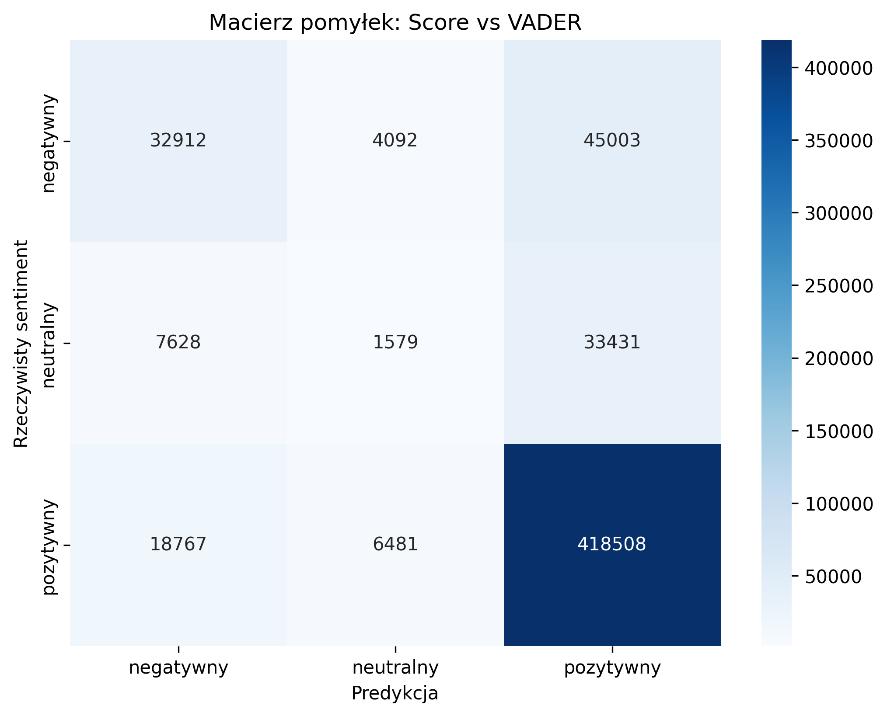

# Analiza sentymentu opinii o produktach za pomocą VADER (NLTK)

## Opis projektu
Celem projektu było przypisanie sentymentu (pozytywny, neutralny, negatywny) do opinii klientów na podstawie tekstu. Wykorzystano narzędzie VADER z biblioteki NLTK.

## Dane
Użyto zbioru danych zawierającego kolumny takie jak: `Text`, `Sentiment`, `Score`, `UserId`. Usunięto wiersze z brakującymi danymi.

## Etapy analizy

1. Wczytanie danych  
   Załadowano dane z pliku CSV i sprawdzono ich strukturę.

2. Czyszczenie danych  
   Usunięto wiersze zawierające wartości `null` przy pomocy funkcji `dropna()`.

3. Eksploracja danych  
   Zliczono wystąpienia etykiet sentymentu: pozytywny, neutralny, negatywny.

4. Analiza sentymentu z VADER  
   Użyto narzędzia `SentimentIntensityAnalyzer` z biblioteki `nltk.sentiment.vader`.  
   Napisano funkcję `vader_sentiment(text)` przypisującą etykiety na podstawie wartości `compound`.

5. Przetworzenie wszystkich tekstów  
   Zastosowano funkcję `vader_sentiment()` do całej kolumny `Text`.  
   Utworzono nową kolumnę `Predicted_Sentiment` zawierającą etykiety przewidziane przez VADER.

6. Porównanie etykiet  
   Porównano etykiety rzeczywiste (`Sentiment`) z przewidywanymi (`Predicted_Sentiment`).  
   Wyświetlono podgląd wyników.

7. Ewaluacja klasyfikatora  
   Wygenerowano raport klasyfikacji (`precision`, `recall`, `f1-score`).  
   Stworzono macierz pomyłek (confusion matrix) i jej graficzną wizualizację.

8. Dokładność klasyfikatora  
   Obliczono dokładność klasyfikatora (`accuracy`) na poziomie 0.7970.

## Wyniki

- Dokładność klasyfikatora VADER: **0.7970**
- Najlepiej rozpoznawane były opinie pozytywne
- Najtrudniejsze do rozpoznania były opinie neutralne

## Macierz pomyłek (graficzna):

## Pliki w repozytorium

- `projekt_sentiment.ipynb` – kod projektu w Jupyter Notebook
- `README.md` – ten plik z opisem
- `confusion_matrix.png` – wizualizacja macierzy pomyłek

